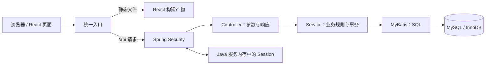

# 活动报名平台：架构与请求流程

这个项目展示一个完整的全栈流程：管理员发布活动，用户查看名额并报名，系统在并发请求下维护正确的报名人数。

## 技术分工

| 层次 | 技术 | 负责的事情 |
| --- | --- | --- |
| 页面 | React、TypeScript、Vite、Ant Design、React Router | 页面路由、表单、加载状态、错误反馈 |
| HTTP 接口 | Java 21、Spring Boot 4.1.1 | 接收请求、参数校验、返回 JSON |
| 身份与权限 | Spring Security、Cookie Session、CSRF | 登录、识别当前用户、校验管理员权限 |
| 业务与事务 | Java 服务层、Spring 事务 | 报名规则、取消规则、事务边界 |
| 数据访问 | MyBatis Spring Boot Starter 4.0.0 | 执行明确的 SQL，包括行锁查询 |
| 数据存储 | MySQL 8.4、InnoDB | 用户、活动、报名记录以及约束 |
| 运行环境 | Maven Wrapper、npm、Docker Compose、Nginx | 构建、启动、同源部署 |

开发时，统一入口是 Vite：页面发出相对路径的 `/api` 请求，由 Vite 代理到 Java 服务。部署时，统一入口是 Nginx：它提供前端静态文件，并把 `/api` 请求转发给后端。两种方式都让浏览器通过同一个来源访问页面和接口。

## 三张业务表

- **用户**：保存登录名、密码哈希、展示名和角色。服务端从登录身份取得用户 ID，报名请求不能自行指定报名人。
- **活动**：保存标题、介绍、地点、开始时间、总名额和当前有效报名人数。创建后不提供修改名额的接口。
- **报名记录**：关联用户与活动，记录有效报名或已取消状态。`(activity_id, user_id)` 设置唯一约束；取消后保留记录，重新报名时更新同一条记录。

需要始终满足：活动的当前人数等于该活动的有效报名记录数，并且在 `0` 到总名额之间。唯一约束保证同一个用户不会有两条报名记录；事务和行锁保证并发操作下人数正确。

## HTTP 接口与访问权限

| 方法与路径 | 行为 | 权限 |
| --- | --- | --- |
| `GET /api/auth/csrf` | 获取后续写请求需要的 CSRF 信息 | 可匿名调用 |
| `GET /api/activities` | 查看活动列表 | 可匿名调用 |
| `GET /api/activities/{id}` | 查看活动详情 | 可匿名调用 |
| `POST /api/admin/activities` | 创建活动 | 管理员 |
| `POST /api/activities/{id}/registration` | 报名或重新报名 | 已登录用户 |
| `DELETE /api/activities/{id}/registration` | 取消报名 | 已登录用户 |
| `GET /api/me/registrations` | 查看当前用户的报名记录 | 已登录用户 |

登录、退出和获取当前用户的接口由认证模块提供。前端根据身份显示入口，最终授权仍由后端执行：隐藏按钮不能阻止别人直接调用接口。

## 一次报名请求怎么走

1. 用户在活动详情页点击报名。前端携带 Session Cookie，以及从认证模块取得的 CSRF 请求头。
2. Spring Security 验证 CSRF 和登录身份。没有登录的请求不会进入报名业务。
3. Controller 接收活动 ID，服务层从可信的登录身份取得用户 ID。
4. 服务层开启 `READ_COMMITTED` 隔离级别的事务，先用 `SELECT ... FOR UPDATE` 锁定活动记录。
5. 取得锁后检查活动是否已经开始，再用普通 `SELECT` 读取该用户的报名记录并检查名额。
6. 已有效报名时直接返回当前结果；首次报名创建记录；重新报名把已取消记录恢复为有效。只有发生状态变化时，才增加一次活动人数。
7. 事务提交后释放锁，接口返回最新结果，前端刷新活动信息和报名状态。

取消也先锁同一条活动记录，然后处理报名状态和人数。开放期间，重复取消不会重复减人数；活动开始后，报名和取消都被拒绝。失败时事务回滚，报名状态和人数一起恢复。

报名记录查询不额外加 `FOR UPDATE`：所有报名状态变更已经被所属活动的行锁保护，`READ_COMMITTED` 下的普通查询能读取等待前一事务提交后的状态。这避免查询空报名键时引入间隙锁，影响其他活动的首次报名。验证既包括单个活动争名额，也包括不同活动同时首次报名。

## Cookie Session 与 CSRF

Session Cookie 是浏览器与服务端之间的身份凭据。用户资料和身份状态保存在 Java 服务内存中，浏览器只保存 Session 标识。登录成功后会话身份发生变化，前端应重新取得 CSRF 信息；退出后清空页面中的用户状态。

浏览器会自动携带 Cookie，因此写请求需要 CSRF 防护。前端先调用 `GET /api/auth/csrf`，按接口返回的请求头名称和令牌设置后续请求。登录、退出、创建活动、报名和取消都属于写请求。读取活动列表不改变业务状态。

## 当前边界与后续演进

第一版运行单个 Java 服务和单个 MySQL 数据库。Java 服务重启后内存 Session 丢失，用户需要重新登录；启动多个 Java 实例之前，需要设计共享会话或其他身份方案。

同一个活动的报名操作通过行锁串行处理，不同活动可以并发处理。热门活动可能产生锁等待；可以根据真实的响应时间和负载，进一步增加限流、监测和容量优化。第一版不引入 Redis，先把数据库一致性和用户流程验证清楚。
