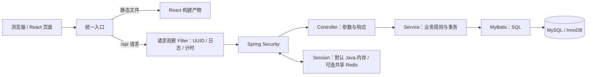

# 活动报名平台：架构与请求流程

这个项目展示一个完整的全栈流程：管理员发布、编辑或取消活动，用户查看名额、报名或进入候补，系统在并发请求下维护正确人数、递补队列并保留取消历史。

## 技术分工

| 层次 | 技术 | 负责的事情 |
| --- | --- | --- |
| 页面 | React、TypeScript、Vite、Ant Design、React Router | 页面路由、表单、加载状态、错误反馈 |
| HTTP 接口 | Java 21、Spring Boot 4.1.1 | 接收请求、参数校验、返回 JSON |
| 请求追踪与指标 | 请求观察 Filter、MDC、结构化日志、Micrometer Timer | 关联请求与安全错误日志，记录当前实例耗时与连接池快照 |
| 身份与权限 | Spring Security、Cookie Session、CSRF | 注册、登录、识别当前用户、校验管理员权限 |
| 会话存储 | 默认 Java 内存；可选 Spring Session Redis | 默认单实例或两个实例共享同一登录与 CSRF |
| 业务与事务 | Java 服务层、Spring 事务 | 报名规则、取消规则、事务边界 |
| 数据访问 | MyBatis Spring Boot Starter 4.0.0 | 执行明确的 SQL，包括行锁查询 |
| 数据存储 | MySQL 8.4、InnoDB | 用户、活动、报名记录以及约束 |
| 运行环境 | Maven Wrapper、npm、Docker Compose、Nginx | 构建、启动、同源部署 |

开发时，统一入口是 Vite：页面发出相对路径的 `/api` 请求，由 Vite 代理到 Java 服务。部署时，统一入口是 Nginx：它提供前端静态文件，并把 `/api` 请求转发给后端。两种方式都让浏览器通过同一个来源访问页面和接口。

## 三张业务表

- **用户**：保存唯一登录名、密码哈希、展示名和角色。自主注册只创建普通用户；服务端从登录身份取得用户 ID，报名和昵称修改请求不能自行指定操作人。
- **活动**：保存标题、介绍、地点、开始时间、总名额和当前有效报名人数。候补人数由报名记录按活动实时统计。开始时间与名额创建后固定；V3 增加取消时间、原因和可信操作人，取消后人数为 0。
- **报名记录**：关联用户与活动，记录有效报名、候补中或已取消状态。`(activity_id, user_id)` 设置唯一约束；取消后保留记录，重新报名时更新同一条记录。

需要始终满足：活动的当前人数等于该活动的 `ACTIVE` 报名记录数，并且在 `0` 到总名额之间；`WAITING` 记录不占用名额。唯一约束保证同一个用户不会有两条报名记录；事务和行锁保证并发操作下人数正确，候补记录按排队顺序递补。

## HTTP 接口与访问权限

| 方法与路径 | 行为 | 权限 |
| --- | --- | --- |
| `GET /api/auth/csrf` | 获取后续写请求需要的 CSRF 信息 | 可匿名调用 |
| `POST /api/auth/register` | 创建普通用户，201 返回资料，不自动登录 | 可匿名调用，需 CSRF |
| `GET /api/auth/me` | 按可信身份从数据库读取最新用户资料 | 已登录用户 |
| `PATCH /api/me/profile` | 只修改当前用户昵称 | 已登录用户，需 CSRF |
| `GET /api/activities` | 查看活动列表 | 可匿名调用 |
| `GET /api/activities/{id}` | 查看活动详情 | 可匿名调用 |
| `GET /api/admin/overview` | 管理概览的八项真实统计（含候补和取消活动数） | 管理员 |
| `GET /api/admin/monitoring` | 当前 Java 实例的请求、耗时和连接池快照 | 管理员 |
| `GET /api/admin/activities` | 搜索、筛选并分页查看活动 | 管理员 |
| `GET /api/admin/activities/{id}/registrations` | 分页查看活动报名名单 | 管理员 |
| `POST /api/admin/activities` | 创建活动 | 管理员 |
| `PATCH /api/admin/activities/{id}` | 修改未开始活动的标题、介绍和地点 | 管理员，需 CSRF |
| `POST /api/admin/activities/{id}/cancel` | 取消活动，保存首次原因、时间和报名历史 | 管理员，需 CSRF |
| `POST /api/activities/{id}/registration` | 报名、重新报名或进入候补；满员时返回 `WAITING` 状态 | 已登录用户 |
| `DELETE /api/activities/{id}/registration` | 取消有效报名或退出候补 | 已登录用户 |
| `GET /api/me/registrations` | 查看当前用户的报名记录 | 已登录用户 |

登录、退出和获取当前用户的接口由认证模块提供。前端根据身份显示入口，最终授权仍由后端执行：隐藏按钮不能阻止别人直接调用接口。

注册经 `AuthController → AccountService → UserMapper`：规范化用户名、校验昵称与密码、使用既有 BCrypt12 哈希、固定 `USER` 角色后插入。`uq_users_username` 决定并发重名的唯一成功者，冲突返回 409 `USERNAME_TAKEN`。昵称修改经 `ProfileController`，只更新登录身份 ID 对应的 `display_name`；详细输入规则见 [账户指南](account-guide.md)。

前端 `/register` 成功后返回登录页，`/profile` 由登录保护后挂载。用户状态仍由 `AuthProvider` 管理，读取/修改资料按账号、认证代次与顺序忽略过期响应，避免旧昵称或旧账号覆盖当前页面。服务端不重写整个 Session `SecurityContext` 来同步昵称，`/auth/me` 直接查数据库最新资料；其他独立会话下一次读取才能更新，没有实时推送或轮询。

## 管理查询与统计口径

管理入口包括概览 `/admin/dashboard`、活动管理 `/admin/activities`、发布活动 `/admin/activities/new`、编辑活动 `/admin/activities/{id}/edit`、报名名单 `/admin/activities/{id}/registrations` 和运行指标 `/admin/monitoring`。页面先通过既有认证与管理员权限检查，再挂载管理查询；普通用户访问这些路径不能触发管理数据请求。

`GET /api/admin/activities` 接受 `page`（默认 1）、`pageSize`（默认 10）、`keyword`（默认空）和 `status`（默认 `ALL`），返回 `{items,total,page,pageSize}`。页码至少为 1，每页 1–100 条，关键词最多 200 字。关键词在标题或地点中作字面子串匹配，`%`、`_` 和反斜杠不会成为通配符；SQL 使用绑定参数和 `LOCATE`。结果按开始时间升序、活动 ID 升序排列。

| 活动筛选 | 口径 |
| --- | --- |
| `ALL` | 所有活动 |
| `UPCOMING` | 未取消且开始时间晚于当前时间，包含满员活动 |
| `OPEN` | 未取消、尚未开始且有剩余名额 |
| `FULL` | 未取消、尚未开始且有效报名人数等于总名额 |
| `STARTED` | 未取消且开始时间等于或早于当前时间 |
| `CANCELLED` | 取消时间非空，不依赖原开始时间 |

概览的 `totalActivities` 是所有活动数，包含已取消活动；`cancelledActivities` 单独统计取消活动。`upcomingActivities` 和 `startedActivities` 对应上述排除取消的时间条件；`fullActivities` 只统计未取消且尚未开始的满员活动；`activeRegistrations` 包含所有活动的 `ACTIVE` 报名记录，`waitingRegistrations` 包含所有活动的 `WAITING` 候补记录；`availableSeats` 只汇总未取消且尚未开始活动的剩余名额。每个请求固定一个 UTC 当前时间，SQL 和返回状态共享这一时间，避免临界时间出现两个口径。

`GET /api/admin/activities/{id}/registrations` 接受同样的分页参数，以及 `ALL`、`ACTIVE`、`WAITING`、`CANCELLED` 状态，返回 `{activity,items,total,page,pageSize}`。名单行包含报名 ID、用户 ID、账号、展示名、状态、创建时间和更新时间，时间使用 UTC；按更新时间降序、报名 ID 降序排列。不存在的活动返回 404。`activity` 同时返回当前 `waitingCount`。

管理列表的总数和当前页查询在只读 `REPEATABLE_READ` 事务的同一快照内执行；概览用一条 SQL 取得八项统计，并单独统计报名表，避免关联多条报名记录后重复累计活动和名额。这些查询不改变报名业务的 `READ_COMMITTED` 事务与行锁设计。

筛选条件或每页数量改变时，前端回到第一页。活动列表在第一页使用相同关键词再次点击查询，也会重新读取服务端数据；其他位置提交搜索回到第一页。报名变化让当前页超出总页数时，两个管理列表自动回到最后一个有效页，最少为第一页。读取请求在页面或账号切换时取消或忽略过期结果，页码校正也不能覆盖更新后的查询条件。

运行指标返回 `scope=CURRENT_JVM`、实例编号及启动/采样时间，页面仅手动刷新。请求数、平均耗时和错误率是本进程累计值；按路由/状态的 P95 与最大值来自 300 秒 Micrometer 旋转窗口，属于近似统计，不能跨路由或实例平均为全局 P95。健康与监控读取不计入自定义 HTTP Timer；活动记录获取耗时包含 SQL 执行与行锁等待。请求标识、日志边界和详细口径见 [请求追踪与运行指标](observability.md)。

## 一次报名请求怎么走

1. 用户在活动详情页点击报名。前端携带 Session Cookie，以及从认证模块取得的 CSRF 请求头。
2. 请求观察 Filter 先生成 `X-Request-Id`，在 Session 和 Spring Security 处理期间保留 MDC；Spring Security 验证 CSRF 和登录身份。没有登录的请求不会进入报名业务。
3. Controller 接收活动 ID，服务层从可信的登录身份取得用户 ID。
4. 服务层开启 `READ_COMMITTED` 隔离级别的事务，先用 `SELECT ... FOR UPDATE` 锁定活动记录。
5. 取得锁后先检查活动是否取消，再检查是否已经开始，然后用普通 `SELECT` 读取该用户的报名记录并检查名额。
6. 已有效报名或已在候补时直接返回当前结果；有空位时首次报名创建 `ACTIVE` 记录，或把已取消记录恢复为 `ACTIVE`，并增加一次活动人数。满员时首次报名创建 `WAITING` 记录，或把已取消记录重新排到候补队列，不增加活动人数。
7. 事务提交后释放锁，接口返回最新结果，前端刷新活动信息和报名状态。

取消也先锁同一条活动记录，然后处理报名状态和人数。取消 `ACTIVE` 记录时先减一，再按 `updated_at ASC, id ASC` 取一条最早候补记录转为 `ACTIVE` 并加一；取消 `WAITING` 记录只退出候补，不触发递补。开放期间，重复取消不会重复改变人数；活动开始后，报名和取消都被拒绝。失败时事务回滚，报名状态和人数一起恢复。

报名记录查询不额外加 `FOR UPDATE`：所有报名状态变更（包括候补递补）已经被所属活动的行锁保护，`READ_COMMITTED` 下的普通查询能读取等待前一事务提交后的状态。这避免查询空报名键时引入间隙锁，影响其他活动的首次报名。验证既包括单个活动争名额、候补递补，也包括不同活动同时首次报名。

内部 `ActivityMapper.lockById` 映射为 `ActivityLockRow`，只读取开始时间、总名额、当前有效人数和取消时间四个业务字段；公开展示的 `ActivityRow` 仍包含标题、介绍、地点、取消原因及实时候补人数。返回前的 `ActivityService.get` 在同一事务内重新读取完整详情，因此收窄锁定投影不会改变公开响应。锁定阶段移除的候补 COUNT 是同一条 SQL 中的子查询，版本对照和实际收益边界见 [查询优化复盘](query-optimization-review.md)。

## 组织者编辑与取消

编辑与整场取消也在 `READ_COMMITTED` 事务中先锁活动主键行。编辑只改三个展示字段；取消把该活动的 `ACTIVE`/`WAITING` 报名变为 `CANCELLED`，人数置 0，并同时保存首次原因、UTC 微秒时间和管理员 ID。已有取消报名的 ID 与更新时间保留，取消整场活动不递补候补。并发报名、用户取消或编辑无论先后顺序，都受同一活动行锁保护；失败全部回滚。

已取消活动返回 `cancelled=true`、原因、时间及 `closed=true`。有效的重复组织者取消保留首次结果，越过原开始时间仍幂等；报名、用户取消和编辑返回 409 `ACTIVITY_CANCELLED`。未取消活动开始后拒绝首次编辑或组织者取消，检查时间发生在取得锁后。V3 的外键和 CHECK 保证取消元数据完整与人数为 0，跨表状态不变量还依赖事务。详细 API、迁移、页面认证代次保护和真实验证路径见 [活动生命周期](activity-lifecycle.md)。

## Cookie Session 与 CSRF

Session Cookie 是浏览器与服务端之间的身份凭据。浏览器只保存 `JSESSIONID`，默认模式把身份和 CSRF 状态保存在当前 Java 进程内存；`redis` profile 把这些会话属性存到共享 Redis。两种模式的默认闲置时限都是 30 分钟。登录成功后会话身份发生变化，前端应重新取得 CSRF 信息；退出后清空页面中的用户状态，并使服务端会话失效。

浏览器会自动携带 Cookie，因此写请求需要 CSRF 防护。前端先调用 `GET /api/auth/csrf`，按接口返回的请求头名称和令牌设置后续请求。注册、登录、退出、修改昵称、创建或编辑活动、取消整场活动、报名、进入候补、取消报名和退出候补都属于写请求。读取活动列表不改变业务状态。

可选 Compose overlay 使用 Nginx 轮询两个相同后端，共用 MySQL、Redis、会话命名空间和时限。请求从 A 切换到 B 时，B 仍通过 Cookie 在 Redis 找到同一身份与 CSRF；不需要客户端指定后端，也不依赖粘滞会话。会话有效且 Redis 可用时，重启一个 Java 实例不会清空共享登录；Redis 失效、会话过期或退出后不能继续使用原身份。

默认 Redis Session 自动配置被明确关闭，仅 `redis` profile 手动启用 Spring Session；默认健康检查不连接 Redis，Redis 模式纳入 Redis 连接检查。连接、命名空间、Cookie 和实际验证方式见 [共享 Session 指南](shared-session.md)。

## 当前边界与后续演进

默认本机和基础 Compose 运行单个 Java 服务和单个 MySQL 数据库；Java 重启后内存 Session 丢失，需要重新登录。可选 Redis 方案提供两个后端的共享会话演示，默认闲置时限为 30 分钟；Redis AOF 和数据卷不等于故障期间零会话丢失，也不提供高可用保证。

同一个活动的报名、取消和候补递补通过 MySQL 行锁串行处理，不同活动可以并发处理。Redis 只保存 Session，不代替数据库约束、事务或候补排序。热门活动可能产生锁等待；当前请求指标和 [固定负载评测](performance-report.md) 用于收集证据，限流和容量优化根据实测另行评估。
