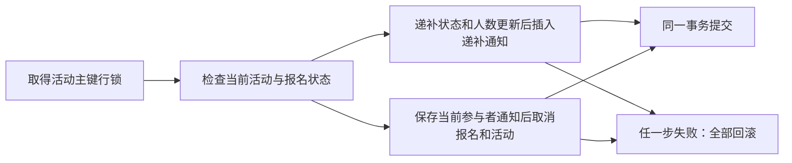

# 站内通知：递补、活动取消与已读状态

`/notifications` 为已登录用户提供站内消息，顶栏铃铛显示本人未读数量。通知只来自两类真实业务变化：候补者被递补为有效报名者，以及管理员取消活动。数据保存到 MySQL；默认内存 Session 和可选 Redis Session 都读取同一套通知记录。

## 通知产生的条件

| 类型 | 收件人 | 产生时机 |
| --- | --- | --- |
| `PROMOTED` | 本次从 `WAITING` 变成 `ACTIVE` 的用户 | 用户取消有效报名，系统按 FIFO 递补后 |
| `ACTIVITY_CANCELLED` | 取消发生时该活动的全部 `ACTIVE`、`WAITING` 用户 | 管理员首次成功取消活动时 |

首次报名、加入候补、取消候补和普通编辑不会生成通知。已经自行取消的用户不在整场取消的收件人集合中；管理员若自己是有效报名者或候补者，也会作为参与者收到通知。

消息保存发生时的活动标题。活动取消通知同时保存当时的公开原因和取消时间；后续展示读取通知行本身，避免以前的递补消息因管理员修改标题而被改写。详情链接仍打开当前活动信息。

第一版没有补发迁移之前的历史事件。V4 新建通知表，从迁移后的真实状态变化开始记录；没有邮件、短信、WebSocket 推送或定时轮询。

## 事务、行锁和重复操作

业务仍由 `RegistrationService`、`ActivityService` 的 `READ_COMMITTED` 事务控制，所有同活动报名、用户取消、编辑和整场取消先锁活动主键行。通知写入使用 `NotificationService` 的 `Propagation.MANDATORY` 方法，只能参加已经存在的业务事务，不另开一个独立提交的事务。

用户取消有效报名时，代码先把自己的记录变成 `CANCELLED` 并减人数，再按 `updated_at ASC, id ASC` 找最早候补者。实际存在候补者时，将其改为 `ACTIVE`、加回人数，再插入一条递补通知。活动主键锁仍持有，标题从这条活动的当前行取得。`created_at` 由这次 SQL 的 `UTC_TIMESTAMP(6)` 生成。

管理员取消活动时，代码在持有同一行锁、确认尚未取消且未开始后，先把当前 `ACTIVE`/`WAITING` 集合插入取消通知，再把这些报名改为 `CANCELLED`、人数归零并保存活动取消元数据。插入必须早于报名状态批量取消，否则收件人条件会变成空集合。通知的 `created_at` 与活动的 `cancelled_at` 使用同一个服务端 UTC 微秒时间和同一个规范化原因。

通知插入失败会回滚原用户取消或整场取消；通知已经插入、后续业务 SQL 失败时，也会连同人数和状态一起回滚。用户不会看到数据库已保存但实际没有发生的业务消息。

重复取消有效报名，在取得锁后已是 `CANCELLED`，不会再次递补或生成通知。重复组织者取消，在取得锁后已存在取消时间，返回首次结果，不再次插入。并发重复请求也按相同行锁串行判断。

这里不能给 `(user_id, activity_id, type)` 加永久唯一约束：同一用户被递补后，可以取消、重新进入候补，再次真正递补。第二次事件应产生新的通知 ID 和未读状态。幂等依据是真实状态转换与事务行锁，通知表不是每类消息只能存在一次。

## V4 数据模型

`V4__create_notifications.sql` 新增第四张业务表，不修改已经执行的 V1–V3：

- `user_id`、`activity_id` 是收件人与活动的外键，使用 `ON DELETE RESTRICT` 保留历史约束。
- `type` 只能是上述两类；快照标题不能为空。递补消息的取消原因必须为空，活动取消消息必须有合法原因。
- `created_at`、`read_at` 为 UTC `DATETIME(6)`；未读是 `read_at IS NULL`，已读时间不得早于创建时间。
- `(user_id, created_at DESC, id DESC)` 支持本人时间排序；另有包含 `read_at` 的索引，用于未读/已读读取。

普通用户接口不提供删除通知或批量标读。打开通知页面、跳转详情不会自动标记已读，用户通过每条消息的“标记已读”明确操作。

## 接口、权限与快照

| 方法与路径 | 响应 | 权限 |
| --- | --- | --- |
| `GET /api/me/notifications` | `{items,total,page,pageSize,unreadCount}` | 当前登录用户 |
| `GET /api/me/notifications/unread-count` | `{unreadCount}` | 当前登录用户 |
| `POST /api/me/notifications/{id}/read` | 标记后的单条通知 | 当前登录用户，需 CSRF |

列表默认 `page=1`、`pageSize=10`、`status=ALL`。页码为正的 Java `int`；每页 1–100 条；状态只能是区分大小写的 `ALL`、`UNREAD`、`READ`。空数字、非法数字、越界数量或未知状态返回 400 `VALIDATION_ERROR`。SQL 使用绑定参数，不拼接客户端输入。

每条通知包含 `id`、`type`、`activityId`、`activityTitle`、`cancellationReason`、UTC `createdAt` 和可空的 UTC `readAt`。响应不提供收件人列表或其他用户资料。用户 ID 来自可信的 `AppUserDetails`；传入 `userId` 等字段不能选择其他收件人。

`total` 是本人当前状态筛选下的匹配数；`unreadCount` 始终是本人全部未读消息数，不受状态和分页影响。例如 21 条消息，其中 15 条未读，以每页 10 条查看已读筛选时，未读数仍为 15，已读筛选总数为 6，第一页显示这 6 条消息。列表按 `created_at DESC, id DESC` 排序，以 ID 消除时间相同时的顺序歧义。

`NotificationService.page` 在只读 `REPEATABLE_READ` 事务中读取未读数、筛选总数和当前页，三条 SQL 共用 InnoDB 一致性快照。并发标读或新通知提交时，本次响应不会混用新旧数据；下一次请求再读取新状态。超过末页时接口返回空 `items`，保留真实总数与请求页码，由页面修正到最后一个合法页，最少为第一页。

标读使用 `READ_COMMITTED` 事务。SQL 条件同时限定通知 ID、当前用户 ID 和 `read_at IS NULL`，第一次成功写入 `GREATEST(created_at, 服务端当前 UTC 微秒时间)`；随后查询本人通知返回结果。重复请求或并发标读保留第一次时间，不把每次点击变成新的已读时间。他人的 ID 与不存在的 ID 均返回 404 `NOTIFICATION_NOT_FOUND`，不泄露归属；匿名读取返回 401。

CSRF 继续由既有 Spring Security 与 `api.ts` 处理：只有明确的 403 `CSRF_INVALID` 刷新 Token 并重试一次，401、普通权限拒绝、404 或未知失败不会按 CSRF 静默重放。日志与指标使用固定路由模板，不保存通知标题、原因或用户筛选参数。

## 页面与未读数量的归属

`NotificationProvider` 在既有 `AuthProvider` 下管理顶栏未读数与通知请求协调，不复制登录身份，也不增加另一个 HTTP 客户端。

- 登录身份就绪后，在非通知页面读取一次未读数；进入通知中心后，列表响应直接更新铃铛，不额外读取 `unread-count`。
- 切换状态、翻页、点击“刷新通知”或成功标读后重新读取列表；离开通知中心时读取一次未读数。其他窗口产生消息后，当前窗口需要重新打开或手动刷新通知页。
- 读取中与失败时显示 `—`；只有服务端实际返回 0 才表示没有未读消息。
- 筛选与分页保存在 URL，默认值省略。刷新、历史导航、未登录直达后登录返回保留条件；改变状态或每页数量回第一页。没有使用前端当前页的未读行数推算总数。

列表读取、标读返回和迟到错误都检查请求所属账号与认证代次。即使退出后重新登录同一数字 ID 的账号，旧响应也失效；旧 401 不能退出新会话。页面进一步检查挂载状态、查询条件和取消信号，离开页面后不显示旧成功提示、不覆盖新页面或继续旧导航。

`NotificationRequestOrder` 只管理统计读取顺序：新列表结果会让更早的铃铛请求失效；标读开始和完成都使旧统计读取失效，避免写之前或写期间取得的未读数重新覆盖最新值。页面读取通过 `useResource` 中止旧请求；React Strict Mode 清理也使用同一取消路径，没有重复事件监听和定时任务。

页面按北京时间显示创建及首次已读时间，提供加载、空集合、读取失败重试与登录失效反馈。桌面使用侧栏、手机抽屉进入通知中心，每条消息可打开当前活动详情并查看取消原因。

## 验证与代码阅读

推荐沿一个真实事件阅读：

1. `RegistrationService.cancel` 或 `ActivityService.cancel`：活动主键锁、状态判断、事务以及通知插入时机。
2. `NotificationService.promoted/activityCancelled → NotificationMapper → V4`：事务必须存在、SQL 收件人选择、快照与数据库约束。
3. `NotificationController → NotificationService.page/markRead`：可信身份、筛选校验、只读快照和首次已读时间。
4. `frontend/src/api.ts → notifications.tsx → notificationRequestOrder.ts`：统一 CSRF、认证代次与未读请求顺序。
5. `NotificationsPage.tsx → notificationQuery.ts → Layout.tsx`：URL、翻页修正、操作生命周期、北京时间及顶栏入口。

`NotificationIntegrationTest` 使用真实 MySQL，包含本人权限和 CSRF、筛选分页和统计快照、并发首次标读、数据库约束、重复/再次递补、取消的准确收件人和标题快照、两种行锁先后顺序，以及通知插入前后失败导致的业务回滚。它也检查日志使用固定通知路由、不泄露参数与快照内容。

前端 `notifications.test.mjs` 验证 URL 和读取顺序及认证代次，`api.test.mjs` 验证通知请求不带客户端身份、信号、CSRF 和错误重试边界。`e2e/notifications.spec.ts` 使用真实业务事件验证桌面/手机页面；默认 Compose 冒烟和 Redis 双实例脚本核对通知的持久化、归属和跨实例标读。清理只删除本次准确归属活动的通知，发现临时账号引用外部活动的通知则拒绝整次清理。

代码中的断言与已执行通过是两个事实。各环境最终执行结果和数量统一见 [验证记录](verification.md)；运行命令与安全清理见 [交付指南](delivery-guide.md)，两实例数据与身份流向见 [共享 Session 指南](shared-session.md)。

## 面试演示与取舍

新建名额为 1 的未来活动，用户 A 报名、用户 B 加入候补。A 取消后，B 打开通知中心看到一条递补消息，标读后未读数减少；再由管理员取消活动，B 收到一条带公开原因的取消消息，已经自行取消的 A 没有该取消消息。对照数据库说明人数、状态和通知一起提交，以及重复操作为什么不会多发。

可以用“B 取消后重新候补，再次真正递补”的例子回答为什么通知不能永久按用户、活动和类型去重；用并发标读解释首次时间保留；用标题修改解释事件快照与当前活动详情的区别。真实 MySQL 回滚用例证明失败不会留下半完成事件，具体通过证据引用验证记录。

站内通知可以和业务写入同一个 MySQL 事务，因此当前方案没有引入消息队列。未来若增加邮件或短信，外部发送不能跟数据库一起自动回滚，需要另行设计可靠投递与重试；这不是当前已经实现的能力。同步取消通知的写入成本与大规模分页成本仍需实际测量，不将历史报名 SQL 实验数字用于证明新增通知的性能。
