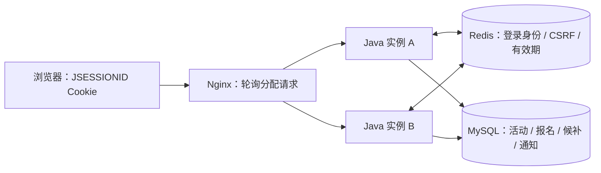

# 共享 Session：两个 Java 实例共用一次登录

默认 Windows 启动脚本和基础 Compose 继续使用单个 Java 实例的内存 Session，不需要 Redis。可选的 `redis` profile 把登录身份和 CSRF 状态存入共享 Redis，使两个实例能够识别同一个 Session Cookie；报名人数、候补、递补、整场活动取消与站内通知仍由 MySQL 事务保证。

## 两种模式

| 项目 | 默认模式 | `redis` profile |
| --- | --- | --- |
| Session 存储 | 当前 Java 进程内存 | 两个 Java 实例共享 Redis |
| 默认闲置时限 | 30 分钟 | 30 分钟，由 Redis 记录有效期 |
| 重启一个 Java 实例 | 原登录失效，需要重新登录 | Redis 中会话仍有效且可用时，原登录可继续使用 |
| 退出登录 | 当前会话失效 | 共享会话失效，两个实例都不再接受原登录 |
| 数据库规则 | MySQL 行锁、事务、唯一约束 | 同一套 MySQL 规则 |
| 必需环境 | Java、MySQL | Java、MySQL、Redis |

浏览器继续使用 `JSESSIONID` Cookie，路径 `/`、HttpOnly、SameSite=Lax，本机 HTTP 默认不设置 Secure；`SESSION_COOKIE_SECURE=true` 用于明确的 HTTPS 环境。Cookie 值是身份凭据，不能打印或提交。切换 Session 存储模式后需要重新登录，不迁移此前内存中的会话。

## 本机容器演示

安装并启动 Docker，在项目根目录准备本地 `.env`，然后执行：

```powershell
docker compose -f compose.yaml -f compose.redis.yaml up --build -d
```

访问 `http://127.0.0.1:8088`。Nginx 以轮询方式把 `/api` 请求分配给 `backend` 和 `backend2`，不依赖粘滞会话；两者使用相同 MySQL、Redis 和 Session 命名空间。Redis 只在容器网络内提供服务，基础演示不暴露 Redis 或 Java 端口。

同一个 Compose 项目已运行默认模式时，先用 `docker compose down` 停止原容器并保留数据库卷，再启动这组 overlay。示例密码仅供本机演示，Redis overlay 使用 `REDIS_PASSWORD`，默认样例为 `local_redis_password`。

查看和停止同一演示项目：

```powershell
docker compose -f compose.yaml -f compose.redis.yaml logs -f backend backend2
docker compose -f compose.yaml -f compose.redis.yaml down
```

停止命令保留 MySQL 和 Redis 命名卷。Redis 开启 AOF 并使用独立数据卷，这提供本地持久化手段；不承诺故障期间零数据丢失或任何情况下永久登录。只有会话未超过闲置时限、Redis 数据尚在且服务可用时，后端重启后的身份恢复才成立。

## 配置与请求路径

| 参数 | 默认值与作用 |
| --- | --- |
| `SPRING_PROFILES_ACTIVE` | 未设置时是内存模式；设置 `redis` 启用共享 Session |
| `REDIS_HOST`、`REDIS_PORT` | Redis profile 默认 `redis:6379`，匹配 Compose 服务名；手动运行 Java 时填写实际地址 |
| `REDIS_PASSWORD` | Java 配置默认空；Redis Compose overlay 注入本地样例密码 |
| `SESSION_NAMESPACE` | `gather:session`，同组实例必须一致；不同项目应使用不同命名空间 |
| `SESSION_TIMEOUT` | `30m`，表示闲置时限；CI 的短时失效验证临时使用 `3s`，结束恢复 `30m` |
| `SESSION_COOKIE_SECURE` | 默认 `false`，保留现有 Cookie 行为 |



登录请求到 A 后，Spring Security 保存的身份进入共享 Session；下一次 `/api/auth/me` 即使到 B，也会按同一 Cookie 找到身份。CSRF 令牌属于同一会话，登录和退出后的轮换对两个实例都适用。后端从可信身份取得报名人和权限，前端不提供用户 ID 来代替认证。

昵称是数据库中的可变资料。`AppUserDetails` 仍包含登录时展示资料快照，但 `/api/auth/me` 按可信 ID 查询最新用户行；修改昵称不整体替换 Session 的 `SecurityContext`。同一账号的两个独立登录会话，下一次在 A 或 B 读取资料时都会得到新昵称，避免为了同步展示值遍历 Redis 或覆盖并发 CSRF/退出状态。退出其中一个 Session 后，另一个独立会话继续有效；没有向其他窗口推送更新。完整账户合同见 [用户注册与个人中心](account-guide.md)。

两个 Java 实例同时报名或由组织者取消同一活动，仍先锁 MySQL 的活动主键记录，再检查状态、修改报名、人数和取消信息；Redis 不存放剩余名额，不参与候补排序。服务实例数增加不会替代数据库不变量或自动提升同一活动的吞吐量。

公开 `GET /api/activities/search` 同样从可信 Session 身份取得个人报名状态，在 A/B 之间保持当前用户归属；匿名请求只能看到公共活动，传入 `userId` 不会取得他人状态。筛选总数与剩余名额仍在 MySQL 的同一只读快照内查询，没有 Redis 列表缓存或跨实例指标汇总。完整合同见 [活动发现指南](activity-discovery.md)。

通知在 V4 的 MySQL 表中保存，不存入 Redis。A 产生的真实递补或取消消息，已提交后可由 B 按可信身份读取；在 B 标记已读后，A 的下一次读取取得同一个首次已读时间。事件写入继续加入持有活动行锁的业务事务，跨实例重复取消不多生成消息。前端仅在打开或手动刷新时读取，列表同步顶栏未读数，没有向其他窗口推送。数据与首次已读时间可跨 Java 重启保留，登录是否保留仍按两种 Session 模式区分；完整合同见 [站内通知指南](notification-guide.md)。

## 从代码中学习

1. `backend/src/main/resources/application.yml` 保留默认 Cookie/闲置时限，关闭默认的 Redis Session 自动配置和 Redis 健康检查，避免本机默认模式依赖 Redis。
2. `application-redis.yml` 绑定连接与命名空间并纳入 Redis 健康检查；`RedisSessionConfiguration` 只在 `redis` profile 下启用 Spring Session Redis，并应用统一闲置时限。
3. `SecurityConfiguration` 保留 Cookie Session、权限、CSRF 与退出处理；`AppUserDetails` 的会话身份对象支持 Redis 所需的序列化。
4. `compose.redis.yaml` 和 `frontend/nginx.redis.conf` 提供两个相同后端与轮询；`X-Gather-Backend` 响应头仅用于这组本地演示确认请求实际落点，不作为身份或权限依据。
5. `RegistrationService`、Mapper 和真实 MySQL 测试继续解释名额、幂等和候补递补，与共享会话配置分开阅读。

两个实例的演示数据初始化使用 MySQL 中按数据库区分的命名锁：专用连接取得锁，事务内只补齐缺失用户和首次三场活动，事务提交后在同一专用连接释放锁。它只保护启动初始化，避免重复用户或活动；报名仍使用活动主键行锁，不把初始化锁扩大到业务请求。

## 怎样证明共享有效

`redis-session` CI 使用真实 Redis、MySQL 和两个 Java 容器。验证脚本 `scripts/redis-session-check.mjs` 的目标是：

- 在 A 获取 CSRF 并完成登录，再用同一 Cookie 从 A/B 读取相同身份；旧 CSRF 被 B 拒绝，A 取得的新令牌可向 B 提交业务请求。
- 管理员与普通用户的权限跨实例保持一致，普通用户调用管理接口仍被拒绝。
- 空库同时启动两个实例后，预置用户和三场演示活动只写入一次，活动和报名初始化不重复。
- 报名、候补、用户取消递补经过不同实例，数据库中人数和状态仍一致。
- 报名与组织者取消通过不同真实 Java 实例同时发出；完成后人数为 0、有效与候补均成为取消历史，原因和 UTC 时间在 A/B 一致，重复取消保留首次结果。活动生命周期合同见 [编辑与取消指南](activity-lifecycle.md)。
- 在 A/B 和 Nginx 分别读取公开筛选分页，核对匹配集合统计、当前登录用户的报名历史；匿名查询附带用户 ID 仍返回 `registrationStatus=null`。恢复普通时限后的完整浏览器回归也包含搜索、分页、URL 与详情返回流程。
- 在 A/B 与 Nginx 读取相同私有递补通知，向另一实例标读，再跨实例重复标读核对首次时间；无 CSRF 或他人 ID 被拒绝。活动取消只通知当时有效/候补者，已经自行取消的人不收到；重启后通知快照和已读历史保留。
- 在 A 获取匿名 CSRF 后向 B 注册普通用户，确认没有自动登录；分别在 A/B 建立两个独立 Session，跨实例修改昵称后，两个会话都能在 A/B 读取最新资料。伪造他人 ID 和管理员角色不能改变操作归属或权限，新账号能够报名。
- 重启 A 后，原 Cookie 仍可在 A/B 识别身份；退出后两个实例都拒绝原登录。
- 新昵称在实例重启和重新登录后保留；注销一个会话的旧 Cookie 在 A/B 均被拒绝，另一个独立会话仍能读取资料。
- 在明确的 CI 隔离环境中把闲置时限设为 3 秒，停止访问后验证失效，再恢复 30 分钟。
- 恢复常规时限后，在轮询入口运行桌面和手机全部浏览器回归，精确清理本轮记录。

CI 直连 Java 端口只为分别核对 A/B，均绑定回环地址；常规演示只使用 Nginx 入口。实际执行数量与成功/失败见 [验证记录](verification.md)，配置或脚本存在不能代替验证通过。

业务写入前还核对五个实际运行容器的项目、服务、环境和回环端口，并创建一条准确 UUID 的 SQL 绑定探针，分别从 A、B 和 Nginx 完整读取验证。探针清理后才取业务基线和建立登录；出现目标不一致时拒绝业务写入，探针 manifest 保留以便精确重试清理。

在一份新的 Linux 临时隔离环境中，可以按 CI 参数复现。需要 Docker 和 Node.js，以下密码均是临时样例；脚本拒绝在其他 Compose 项目或本机演示库执行重启和短时失效检查。

脚本入口要求正常时限 `30m`、命名空间 `gather:session` 和显式 Redis 密码。三个 `REDIS_TEST_*` 地址需匹配解析后的 Compose 回环端口；允许普通演示自定义命名空间，不代表这份固定 CI 演练会接受其他配置。脚本不删除或清空 Redis key；仍有效的自有会话通过正常退出释放，短时会话自然过期。

```bash
export COMPOSE_PROJECT_NAME=gather-redis-ci
export MYSQL_DATABASE=activity_platform_e2e MYSQL_USER=activity
export MYSQL_PASSWORD=activity_ci_password MYSQL_ROOT_PASSWORD=ci_mysql_root_password
export REDIS_PASSWORD=ci_redis_password SESSION_NAMESPACE=gather:session SESSION_TIMEOUT=30m
export APP_PORT=19088 SESSION_COOKIE_SECURE=false
export DEMO_ADMIN_PASSWORD='Admin123!' DEMO_USER_PASSWORD='Demo123!'
export E2E_BASE_URL=http://127.0.0.1:19088
export E2E_DB_HOST=127.0.0.1 E2E_DB_PORT=33306 E2E_DB_NAME=activity_platform_e2e
export E2E_DB_USERNAME=activity E2E_DB_PASSWORD=activity_ci_password
export REDIS_TEST_BASE_URL=http://127.0.0.1:19088
export REDIS_TEST_A_URL=http://127.0.0.1:19081 REDIS_TEST_B_URL=http://127.0.0.1:19082
npm ci
node --test scripts/redis-session-check.test.mjs
npx playwright install --with-deps chromium
docker compose -f compose.yaml -f compose.redis.yaml -f .github/compose.ci.yaml -f .github/compose.redis-ci.yaml up --build -d --wait --wait-timeout 180
node scripts/redis-session-check.mjs
npm run test:e2e
docker compose -f compose.yaml -f compose.redis.yaml -f .github/compose.ci.yaml -f .github/compose.redis-ci.yaml down
```

共享会话检查报告写入 `.runtime/ci/redis-session-check.json`，不包含 Cookie、密码或 Token。报告列出实际通过的检查与精确清理数量。最后停止命令保留卷；只有 CI 本次新建的隔离卷才由 CI 收尾删除。短时限场景重新创建后端可能改变容器 IP，脚本同时重启 Nginx，使其重新解析地址，恢复常规配置后才继续浏览器检查。

账户注册前会在忽略目录写入准确创建意图，预声明昵称修改前后的允许值；脚本只注销自己建立的会话。数据库清理先验证活动与账号全部归属、`USER` 角色及本轮外引用（包含活动取消人和通知关联），再在同一事务删除准确归属活动的通知、报名、活动和用户，并与运行前四张业务表快照核对。昵称被改为未声明值、账号角色改变或出现外部引用时，整次清理拒绝，不扩大删除范围。

共享 Session 依赖 Redis。Redis 不可用时，共享身份读取与保存会受影响，Redis profile 的健康检查也会反映连接问题；当前没有自动切回内存、Redis 高可用或无缝跨版本会话升级方案。不同 Java 版本或不同身份对象结构同时滚动升级，需要另行评估序列化兼容性。
